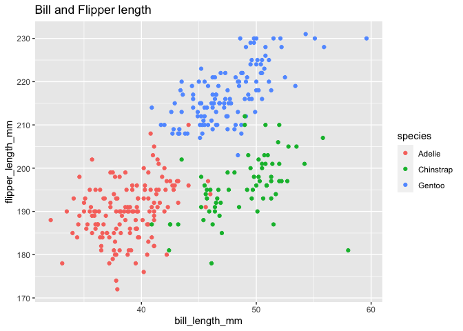

Homework 1
================
Laura Gomez

This is my solution to HW 1.

``` r
library(tidyverse)
```

    ## ── Attaching packages ───────────────────────────────────────────────────── tidyverse 1.3.0 ──

    ## ✓ ggplot2 3.3.2     ✓ purrr   0.3.4
    ## ✓ tibble  3.0.3     ✓ dplyr   1.0.2
    ## ✓ tidyr   1.1.2     ✓ stringr 1.4.0
    ## ✓ readr   1.3.1     ✓ forcats 0.5.0

    ## ── Conflicts ──────────────────────────────────────────────────────── tidyverse_conflicts() ──
    ## x dplyr::filter() masks stats::filter()
    ## x dplyr::lag()    masks stats::lag()

# Problem 1

Create a data frame with the specified elements from a standard
*normal\_distribution*.

``` r
prob1_df =
  tibble(
    samp = rnorm(10),
    samp_gt_0 = samp > 0,
    char_vec = c("a", "b", "c", "d", "e", "f", "g", "h", "i", "j"),
    factor_vec = factor(c("low", "low", "low", "mod", "mod", "mod", "mod", "high", "high", "high" ))
  )
```

Take the mean of each variable in my data frame.

``` r
mean(pull(prob1_df, samp))
```

    ## [1] -0.02366857

``` r
mean(pull(prob1_df, samp_gt_0))
```

    ## [1] 0.5

``` r
mean(pull(prob1_df, char_vec))
```

    ## Warning in mean.default(pull(prob1_df, char_vec)): argument is not numeric or
    ## logical: returning NA

    ## [1] NA

``` r
mean(pull(prob1_df, factor_vec))
```

    ## Warning in mean.default(pull(prob1_df, factor_vec)): argument is not numeric or
    ## logical: returning NA

    ## [1] NA

I can take the mean of numbers and logical but not of characters or
factors.

``` r
as.numeric(pull(prob1_df, samp))
```

    ##  [1] -1.1343929  1.9528192  1.3848073  0.2798220 -0.4696428 -1.8698843
    ##  [7]  0.8456416 -1.6020666 -0.5178468  0.8940577

``` r
as.numeric(pull(prob1_df, samp_gt_0))
```

    ##  [1] 0 1 1 1 0 0 1 0 0 1

``` r
as.numeric(pull(prob1_df, char_vec))
```

    ## Warning: NAs introduced by coercion

    ##  [1] NA NA NA NA NA NA NA NA NA NA

``` r
as.numeric(pull(prob1_df, factor_vec))
```

    ##  [1] 2 2 2 3 3 3 3 1 1 1

I successfully took the mean of each numerical variable in the data set.

``` r
as.numeric(pull(prob1_df, samp_gt_0)) * pull(prob1_df, samp)
```

    ##  [1] 0.0000000 1.9528192 1.3848073 0.2798220 0.0000000 0.0000000 0.8456416
    ##  [8] 0.0000000 0.0000000 0.8940577

# Problem 2

Start by loading the data set, **penguins**.

``` r
data("penguins", package = "palmerpenguins")
```

The **penguins** data set has 344 rows and 8 columns. The mean flipper
length is 200.9152047. The data contains the following:

  - The **penguins** data set has the following labels: bill\_depth\_mm,
    bill\_length\_mm, body\_mass\_g, flipper\_length\_mm, island, sex,
    species, year.

  - The values for the **species** are Adelie, Chinstrap, Gentoo with
    the following:

  - The values for the **Bill\_Length** are 32.1, 39.225, 44.45,
    43.9219298, 48.5, 59.6, 2mm. The mean is 43.9219298 and median is
    44.45. There is no mode.

  - The values for the **Body\_Mass** are 2700, 3550, 4050, 4201.754386,
    4750, 6300, 2 grams. The mean is 4201.754386 and median is 4050.
    There is no mode.

  - The values for the **Flipper\_Length** are 172, 190, 197,
    200.9152047, 213, 231, 2 mm. The mean is 200.9152047 and median is
    197. There is no mode.

  - The years column contains the following: 2007, 2007, 2008, 2008,
    2009, 2009.

This code chunk below generates a scatter plot contrasting **Flipper
Length** and **Bill Length**.

``` r
ggplot(penguins, aes( x = bill_length_mm, y = flipper_length_mm, color = species)) + geom_point() + labs(title = "Bill and Flipper length", xlab = "Bill Length (mm)", ylab = "Flipper Length (mm)")
```

    ## Warning: Removed 2 rows containing missing values (geom_point).

<!-- -->

``` r
ggsave("scatter_plot.pdf", height = 4, width = 6)
```

    ## Warning: Removed 2 rows containing missing values (geom_point).
